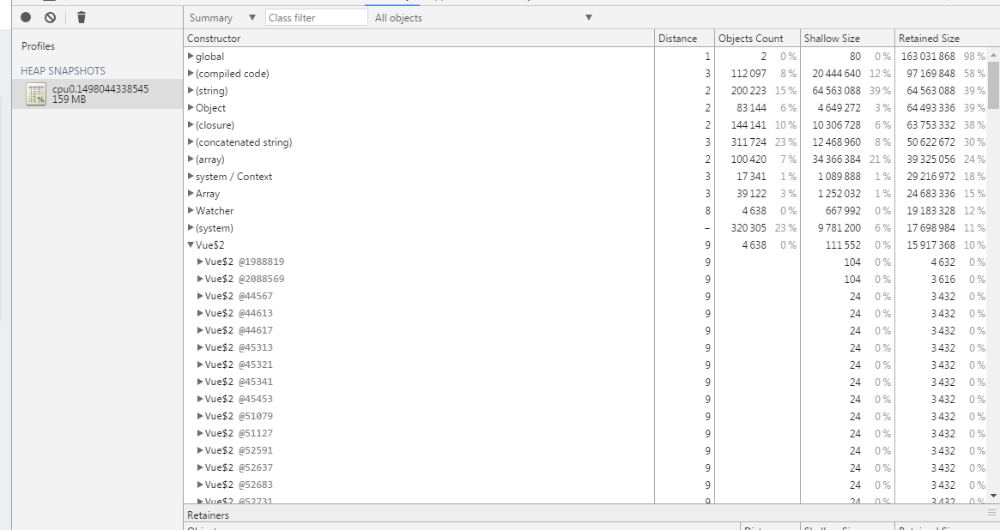

### node app.js

### Confusing in using Vue Server Render

> In our Project, I create vue object in server side, unfortunately, when i write function in "computed", because of irresistible reason, it cause error and without return.
> then I tried to using VueRender.renderToString to parse the vue obj to html string, then, it casuse error "[VUE warn]: Error in render function: (found in <Root>)", it is ok, However, when we have a lot of requests for this page, the memory leak is happened!

> i find the object Vue$2 has created again and again although the error has throwed, when i have a lot of request.

### this is just example, the true enviorment is the picture above